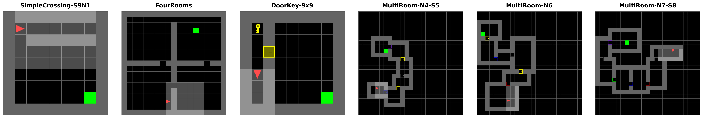
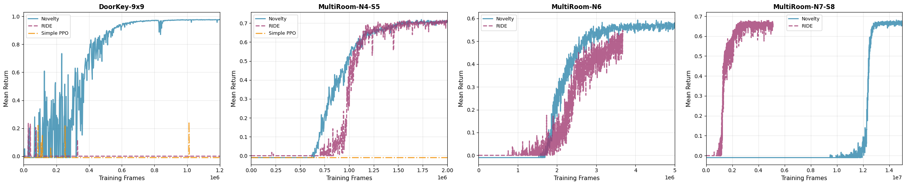

# MiniGrid with Curiosity

**Intrinsic motivation for exploration in sparse-reward reinforcement learning.**

Hard-exploration tasks give the agent *zero* reward until it stumbles onto a distant goal, so naive
policy-gradient methods almost never learn. This project implements and compares two ways of generating an
internal "curiosity" reward to drive exploration — **object-centric novelty curiosity** and **RIDE**
(Rewarding Impact-Driven Exploration) — on top of a recurrent **PPO-LSTM** agent, across six
[MiniGrid](https://github.com/Farama-Foundation/Minigrid) tasks of increasing difficulty.

Built with PyTorch · PPO + LSTM · Gymnasium / MiniGrid. Full writeup: [`AA228_CS238_Report.pdf`](AA228_CS238_Report.pdf).

## Trained agents

Each GIF shows a trained policy solving **three different procedurally generated mazes**. The agent only sees a
7×7 egocentric window (the lit region); everything beyond walls is hidden, so it must use memory to localize.

| SimpleCrossing-S9N1 | FourRooms | DoorKey-9x9 |
| :---: | :---: | :---: |
|  |  |  |
| PPO-LSTM baseline | PPO-LSTM baseline | Novelty curiosity |
| Cross to the goal | Navigate four connected rooms | Key → unlock door → goal |

| MultiRoom-N4-S5 | MultiRoom-N6 | MultiRoom-N7-S8 |
| :---: | :---: | :---: |
|  |  |  |
| Novelty curiosity | Novelty + count | Novelty + count |
| Explore 4 rooms | Explore 6 rooms | Explore 7 rooms |

## The challenge

MiniGrid is a standard benchmark for exploration because every task combines three difficulties:

- **Sparse reward** — non-zero feedback only on success (e.g. a precise *find key → open door → reach goal*
  sequence, or fully traversing a 7-room maze).
- **Partial observability** — a 7×7 first-person view; the agent can't see past walls and must remember where
  it has been.
- **Procedural generation** — layouts, object placements, and goal positions are randomized every episode, so
  the agent must *generalize*, not memorize.



## Approach

### Backbone — PPO-LSTM
A recurrent actor-critic optimized with PPO. Observations pass through 3 convolutional layers into an LSTM,
whose hidden state feeds separate actor and critic heads. The LSTM is what makes partial observability
tractable — without memory the agent cannot, for example, track which rooms it has already cleared in
FourRooms. This is the shared backbone for every method below.
&nbsp;&nbsp;→ [`models/ppo_lstm.py`](src/models/ppo_lstm.py)

### RIDE — impact-driven exploration
Rewards transitions that produce a large change in a *learned* state embedding φ:

```
r_int(t) = ‖ φ(s_t+1) − φ(s_t) ‖₂   ÷  √N_ep(s_t+1)
```

φ is trained online with forward + inverse dynamics objectives, and the reward is divided by an episodic
visitation count so the agent can't farm a few high-impact states. **Contribution:** first-person views make
*turning* produce huge visual changes (and thus pathological spinning), so we add an action-dependent scale
`α(turn) = τ < 1` that down-weights rotation while preserving impact-driven exploration.
&nbsp;&nbsp;→ [`models/ride.py`](src/models/ride.py)

### Novelty curiosity — object-centric
Inspired by how humans gravitate toward distinctive objects. Instead of pixel-change, it uses MiniGrid's
symbolic representation to reward *semantic* interaction:

- **Approach reward** — moving closer to a novel object (key, door, box).
- **Interaction reward** — successfully picking up / toggling / reaching a novel object.
- **Novelty decay** — each object's value decays as `N(o) = e^(−0.01·interactions)`, so repeated interactions
  stop paying out.
- **Episodic count bonus** — `1/√N_ep(s)` to push broad spatial coverage in the largest mazes.

&nbsp;&nbsp;→ [`curiosity_modules/novelty.py`](src/curiosity_modules/novelty.py), [`models/ppo_lstm_novelty.py`](src/models/ppo_lstm_novelty.py)

## Results



Final mean return after training (each cell is the same metric; **✅** marks a solved task, **✗** a failure,
**–** not evaluated):

| Task | Simple PPO | RIDE | Novelty curiosity |
| :--- | :---: | :---: | :---: |
| SimpleCrossing-S9N1 | ✅ 0.96 | – | – |
| FourRooms | ✅ 0.65 | – | – |
| DoorKey-9x9 | ✗ 0.00 | ✗ 0.24 | ✅ 0.98 |
| MultiRoom-N4-S5 | ✗ 0.00 | ✅ 0.70 | ✅ 0.70 |
| MultiRoom-N6 | ✗ 0.00 | ✅ 0.60 | ✅ 0.57 |
| MultiRoom-N7-S8 | ✗ 0.00 | ✅ 0.68 | ✅ 0.68 |

*Convergence speed (frames for novelty curiosity to solve): DoorKey ≈ 0.3M · N4-S5 ≈ 1M · N6 ≈ 3M ·
N7-S8 ≈ 12.5M (with the count bonus).*

**Key finding — the two curiosity signals are complementary:**

- **RIDE excels at navigation, fails at manipulation.** Moving between rooms causes large visual changes (big
  intrinsic reward), but picking up a key or toggling a door barely changes the view — so RIDE ignores exactly
  the actions DoorKey requires.
- **Novelty excels at manipulation.** It rewards *semantic* distinctiveness rather than visual change, so it
  reliably learns the key→door→goal chain that RIDE can't.
- **The biggest maze needs both ideas.** Object bonuses guide the agent *through* doors but not *across* empty
  space; adding the episodic count bonus was what cracked MultiRoom-N7-S8.

The PPO-LSTM baseline solves only the two easy tasks and flatlines at zero reward everywhere else — confirming
that intrinsic motivation, not architecture, is the bottleneck.

<details>
<summary>Per-task training curves</summary>

**Baseline** — [SimpleCrossing](src/experiment_data/simple_ppo_json/simple_ppo_simplecrossing_training_curves.png) ·
[FourRooms](src/experiment_data/simple_ppo_json/simple_ppo_fourrooms_training_curves.png)

**Novelty curiosity** — [DoorKey](src/experiment_data/novelty_json/novelty_doorkey_training_curves.png) ·
[MultiRoom-N4](src/experiment_data/novelty_json/novelty_multiroomn4_training_curves.png) ·
[MultiRoom-N6](src/experiment_data/novelty_json/novelty_multiroomn6_training_curves.png) ·
[MultiRoom-N7](src/experiment_data/novelty_json/novelty_multiroomn7_training_curves.png)

</details>

## Repository layout

```
src/
├── models/
│   ├── ppo_lstm.py            # PPO-LSTM baseline (recurrent actor-critic)
│   ├── ppo_lstm_novelty.py    # PPO-LSTM + novelty curiosity agent
│   └── ride.py                # RIDE intrinsic reward + dynamics models
├── curiosity_modules/
│   └── novelty.py             # object-centric approach / interaction / count rewards
├── envs/
│   └── env.py                 # MiniGrid env wrappers + custom task registrations
├── training/
│   ├── train.py               # training loop
│   └── evaluate.py            # checkpoint evaluation
└── make_gifs.py               # render the demo GIFs above
assets/gifs/                   # trained-agent demo GIFs
AA228_CS238_Report.pdf         # full writeup
```

## Setup

Install [uv](https://docs.astral.sh/uv/getting-started/installation/), then:

```bash
uv sync
```

### Reproduce the GIFs

From `src/`, with the venv active:

```bash
python make_gifs.py
```

This loads the best checkpoint per task, rolls the policy out across three procedurally generated mazes, and
writes GIFs to `assets/gifs/`. Trained checkpoints are not committed (large binaries) — train your own with
`src/training/train.py` to regenerate them.

## Authors

Eric Xia (PPO-LSTM baseline, training infrastructure, novelty-based curiosity) and Qi Wu (RIDE intrinsic
reward and turning-bias fix). Stanford CS238 / AA228. See the [report](AA228_CS238_Report.pdf) for full
method, hyperparameters, and references.
