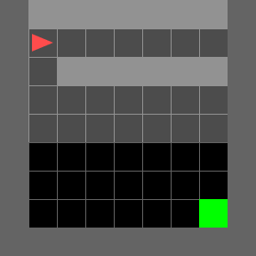
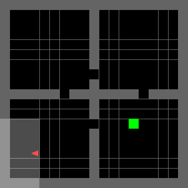
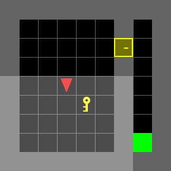
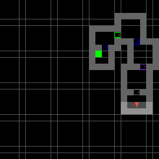
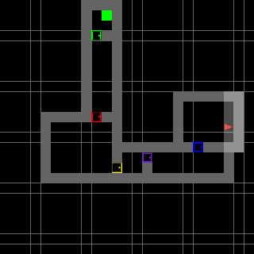
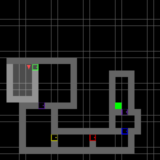

# MiniGrid with Curiosity

Intrinsic motivation for exploration in sparse-reward [MiniGrid](https://github.com/Farama-Foundation/Minigrid)
environments. We implement and compare a **novelty-based curiosity** module (object-centric approach and
interaction bonuses plus an episodic count term) and **RIDE** (Rewarding Impact-Driven Exploration), both on
top of a recurrent PPO-LSTM agent. See [`AA228_CS238_Report.pdf`](AA228_CS238_Report.pdf) for the full writeup.

## Trained agents

Each GIF shows a trained policy (partial 7×7 egocentric view) solving the task. The lit region is the agent's
current field of view; the red triangle is the agent and the green square is the goal.

| SimpleCrossing-S9N1 | FourRooms | DoorKey-9x9 |
| :---: | :---: | :---: |
|  |  |  |
| PPO-LSTM baseline | PPO-LSTM baseline | Novelty curiosity |
| Cross the room to the goal | Navigate four connected rooms | Pick up the key, unlock the door, reach the goal |

| MultiRoom-N4-S5 | MultiRoom-N6 | MultiRoom-N7-S8 |
| :---: | :---: | :---: |
|  |  |  |
| Novelty curiosity | Novelty + count | Novelty + count |
| Explore 4 procedurally generated rooms | Explore 6 rooms | Explore 7 rooms to find the goal |

## Setup

### 1. Install uv

https://docs.astral.sh/uv/getting-started/installation/#pypi

### 2. Create virtual environment

```
uv sync
```

## Reproducing the GIFs

From the `src/` directory, with the venv active:

```
python make_gifs.py
```

This loads the best checkpoint for each environment from `src/checkpoints/<run>/best_model.pt`, rolls out the
policy across three procedurally generated mazes per task, and writes animated GIFs to `assets/gifs/`. The
trained checkpoints are not committed to the repo (they are large binaries); train your own with
`src/training/train.py` to regenerate them.
